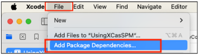
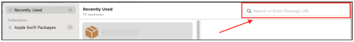
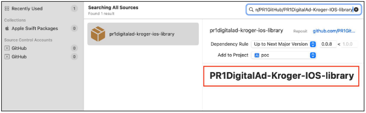
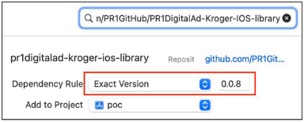
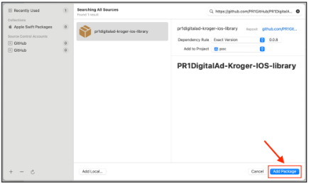
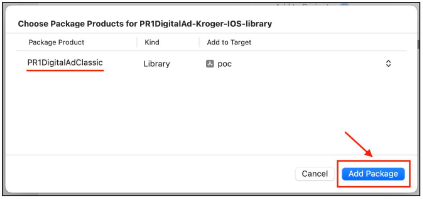
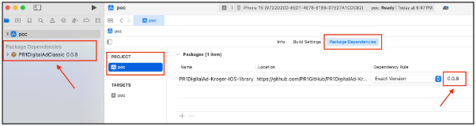

# PR1DigitalAd-Kroger-IOS-library

PR1DigitalAd Classic iOS Framework Integration

**[ Current SDK Version : 0.0.8 ]**

Adding Swift Package

To integrate the PR Digital Ad Classic library into iOS app, follow these steps:

1. Open your Xcode project. Navigate to **File > Add Package Dependencies**.

   

2. You will be presented with a dialog box to add dependencies.

   

   Add the following url : [https://github.com/PR1GitHub/PR1DigitalAd-Kroger-IOS-library ](https://github.com/PR1GitHub/PR1DigitalAd-Kroger-IOS-library)in the **Enter Package URL** field.

3. It populates the package description as shown below.

   

4. Change the dependency rule to **Exact Version** from the dropdown and enter the version number. Check if it points to your project. Else choose an appropriate project from the **Add to Project** dropdown.

   

   Then click on the **Add Package** button.

   

5. Xcode will fetch the package from the url provided.

   

   Click on the **Add Package** button.

6. The package will now be added as a dependency to your project.

   

   **Note:**

   When a new version of the library is released, make sure to *update the version number* next to the *Dependency Rule dropdown* to fetch the latest SDK.
